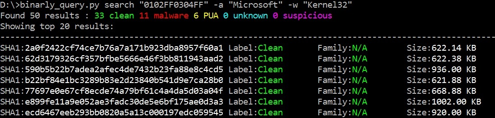
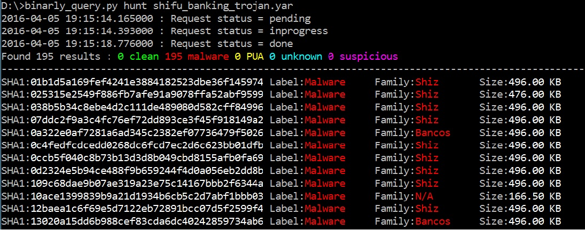
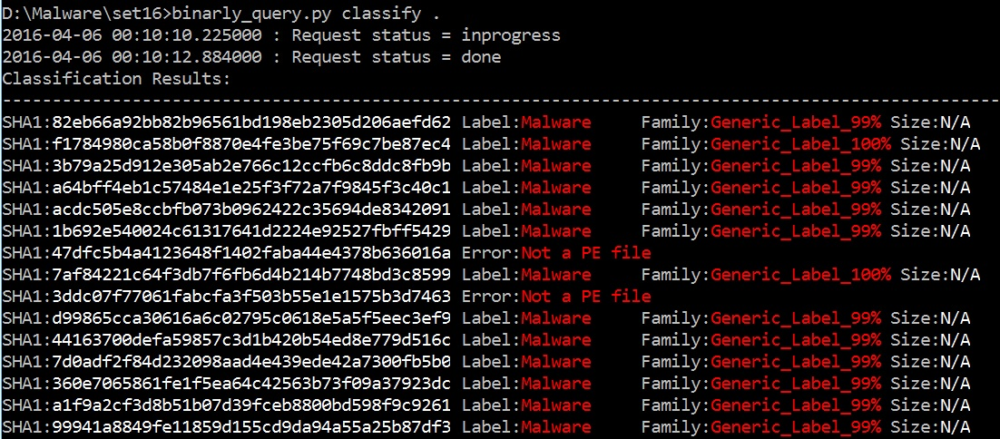

#Binarly Query
Command-line script to interact with the Binarly API.
#Dependencies
1. [Binarly-SDK](https://github.com/binarlyhq/binarly-sdk)
2. Colorama `pip install colorama`

#Configuration
To use this script you need an API key from [Binarly](https://binar.ly). Just register for free, activate your account and you will receive an API key in your inbox.

The API Key can either be passed to the script using `--key` option or can be saved in a file named `apikey.txt` in the same directory.

#Usage
__Binarly__ is binary search engine with __extremely fast query times__ (measured in milliseconds) for arbitrary sequences of bytes over millions of clean and malicious binaries.

In order to take full advantage of Binarly, a few concepts have to be explained first.

Our implementation is based on indexing files with a [4-gram](https://en.wikipedia.org/wiki/N-gram) granularity. When searching for a pattern such as `01 02 03 04 05 06`, the query is split into 4-grams that are looked up independently: `01 02 03 04`, `02 03 04 05` and `03 04 05 06`. Since the offsets of the 4-grams are not stored in the index, Binarly can potentially return files that contain all the 4-grams from the search pattern but not the pattern itself. We call such results "false positives".

Users can specify the `--exact` flag to enable actual validation of search results and filter out "false positives".

The `binarly_query` script provides an interface to the following services:

* [Search](#Search)
* [IOC Generation](#ioc-generation)
* [Sample Hunting With YARA Signatures](#sample-hunting-with-yara-signatures)
* [File Classification](#file-classification)

# Search
The most basic operation that we expose is searching for binary and string patterns using the following `modifiers`:
* Arbitrary hex patterns i.e: `"00 01 02 03 04"` or `"01020304"`
* ASCII strings i.e `-a "Microsoft"`
* WIDE strings i.e `-w "Microsoft"`

__Search options:__
* `--exact` Filter out false positives. When this option is used, the statistics returned apply only to the current result limit.
* `--limit=N` Limit search results to the first N. By default, this value is 20. Specifying a value of 0 means that only statistics (the number of files matching this pattern) will be returned. If `--exact` is not specified the statistics returned apply to all results, not only the ones displayed.

Below is an example of searching for files that contain a combination of patterns, with default limit 20:
* Hex sequence `"01 02 FF 03 04 FF"`
* ASCII string `"Microsoft"`
* Unicode string `"Kernel32"`

__Command:__

__`binarly_query.py search "0102FF0304FF" -a "Microsoft" -w "Kernel32"`__

__Output:__



Below is an example of an __exact__ match with the same default limit of 20:

__Command:__

__`binarly_query.py search "eb 04 03 c0 85 d2 52 eb 05 8d 1a 8d 4a fb 52 8b" --exact`__

__Output:__


__Best practice__: try to use normal searches to reduce the number of matching files and, optionally,at the end use `exact` search to validate the results

# IOC Generation
__Binarly__ provides an API to automatically generate [YARA](https://plusvic.github.io/yara/) rules that cover a specified set of files. The algorithm for selecting signature patterns has access to the entire universe of data indexed by the search engine, enabling it to identify the best signature candidate for a given file.

The following are true for all Binarly generated YARA rules:
* Each code pattern that make up a rule is _guaranteed not to hit on any of the millions of clean files_ indexed
* For performance reasons, the first 4-gram of every pattern is selected such that the probability of the entire pattern to match is extremely high
* The generated YARA rules are generic, i.e: they cover hundreds and even thousands of malicious files.

The command `sign` accepts as input one of the following:
* file names
* directory paths
* file hashes: MD5, SHA-1 and SHA-256

`sign` accepts the following switches:
* `--cluster` - this informs the signing process that the submitted files should be treated as being part of the same cluster i.e one signature should cover multiple files. This option is set to `False` by default.
* `--patternCount` - sets the number of patterns that will make up the rule. Default value is 3.
* `--strategy` - tells the signer which regions of the file to use, in order to generate rules. The default value is equivalent to `full file`. Another valid option is `strict`: signer will select file regions which will most probably be available to a resource-limited file scanner (such as an AntiVirus).
* `--upload` - tells the script whether it should upload samples that are not in the Binarly collection when generating IOCs or doing file classification. By default this is set to `True`.

Let's assume you want to sign a sample which has a certain SHA-1:

`binarly_query.py sign ab9d4a010bb8d15c448a486f89ba2471b0e17d62`

If successful, the signing process will generate a number of files:
* A YARA file which contains all of the rules generated for your request. A typical rule would look as follows:

```ini
rule auto_a50d5d0f_8fd1_4c61_a73c_8681bf05981f
{
    meta:
        license = "Non-commercial use only"
        description = "Generated by Binarly (https://www.binar.ly)"
        label = "malware"
        allSampleCount = "6"

    strings:
        // 0x4032e3 03 4d 8c	add	ecx, dword ptr [ebp - 0x74]
        // 0x4032e6 85 c9	test	ecx, ecx
        // 0x4032e8 74 09	je	0x4032f3
        // 0x4032ea 8b 55 ??	mov	edx, dword ptr [ebp - 0x74]
        $a = { 03 4d 8c 85 c9 74 09 8b 55 } 
        // 0x401611 8b 4d 8c	mov	ecx, dword ptr [ebp - 0x74]
        // 0x401614 03 4d d0	add	ecx, dword ptr [ebp - 0x30]
        // 0x401617 85 c9	test	ecx, ecx
        // 0x401619 74 ??	je	0x40162c
        $b = { 8b 4d 8c 03 4d d0 85 c9 74 } 
        // 0x402fa7 8b 55 8c	mov	edx, dword ptr [ebp - 0x74]
        // 0x402faa 03 55 8c	add	edx, dword ptr [ebp - 0x74]
        // 0x402fad 85 d2	test	edx, edx
        // 0x402faf 74 09	je	0x402fba
        // 0x402fb1 8b 45 ??	mov	eax, dword ptr [ebp - 0x74]
        $c = { 8b 55 8c 03 55 8c 85 d2 74 09 8b 45 } 

    condition:
        all of them
}
```
* One or more JSON files which contain signature information for each of the signatures generated:
    - signature `patterns`
    - hashes of the `files that are detected` by the signature
    - `label of the detected files` (malware/unwanted softare)
    - `family name` for the malware files detected by this rule

#Sample Hunting With YARA Signatures
While `search` functionality allows one to search for files that contain a certain combination of query terms, you can use the `hunt` command for more complex queries. The sample hunting functionality works straight out of the box with most YARA rules already written.

`hunt` returns a list of files that match a YARA rule specified as input.

Let's assume that you want to search for samples detected by the following rule:

```ini
rule SHIFU_Banking_Trojan {
	meta:
		description = "Detects SHIFU Banking Trojan"
		author = "Florian Roth"
		reference = "http://goo.gl/52n8WE"
		date = "2015-10-31"
		score = 70
	strings:
		$x1 = "\\Gather\\Dividerail.pdb" ascii

		$s0 = "\\payload\\payload.x86.pdb" ascii
		$s1 = "USER_PRIV_GUEST" fullword wide
		$s2 = "USER_PRIV_ADMIN" fullword wide
		$s3 = "USER_PRIV_USER" fullword wide
		$s4 = "PPSWVPP" fullword ascii
		$s5 = "WinSCard.dll" fullword ascii /* Goodware String - occured 83 times */
	condition:
		uint16(0) == 0x5a4d and ($x1 or 5 of ($s*))
}
```

__Command:__

If the rule is contained in a file named `shifu_banking_trojan.yar`:

`binarly_query.py hunt shifu_banking_trojan.yar`

__Output:__



Constraints:
* Only one YARA rule per request is allowed

Current limitations:
* Regular expression are not supported (yet)
* Count (`#`) operator is not supported (yet)
* YARA rules without strings is not supported

#File classification
One of the most useful and powerful features of Binarly is an API that classifies files as either clean or malicious based on an advanced __Machine Learning__ model. The model is trained using millions of samples with over 500,000 Machine Learning features per file. It is frequently updated in order to take into account the latest threats.

The `classify` command accepts one of:
* file names
* directory paths
* file hashes: MD5, SHA-1 and SHA-256

File classification is __extremely fast__ because it relies on static file features.

Below is an example of classification done on all of the file in a directory:

